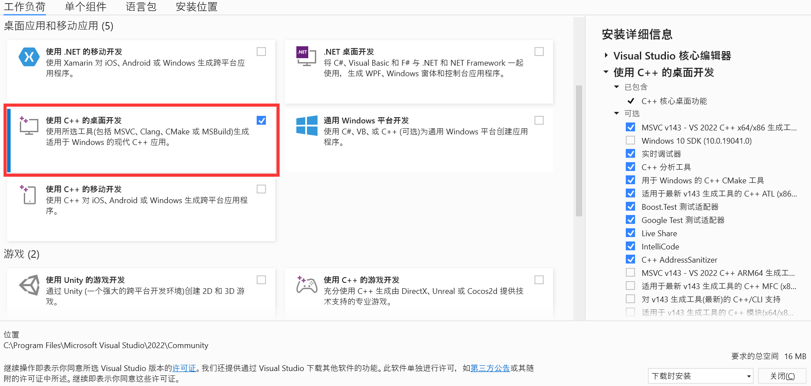
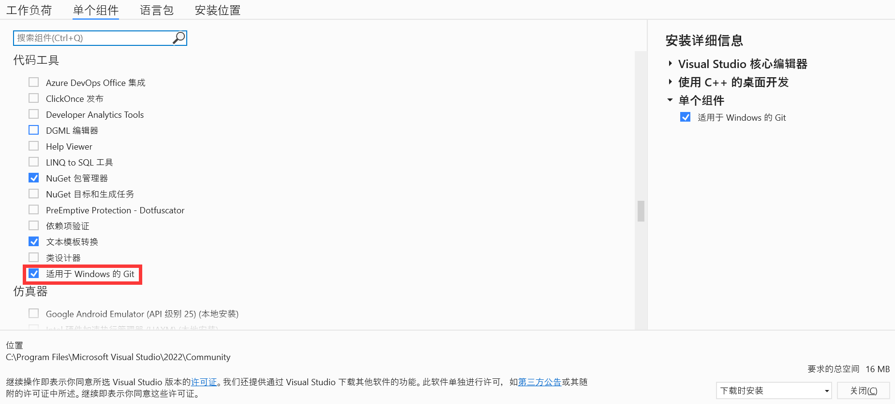
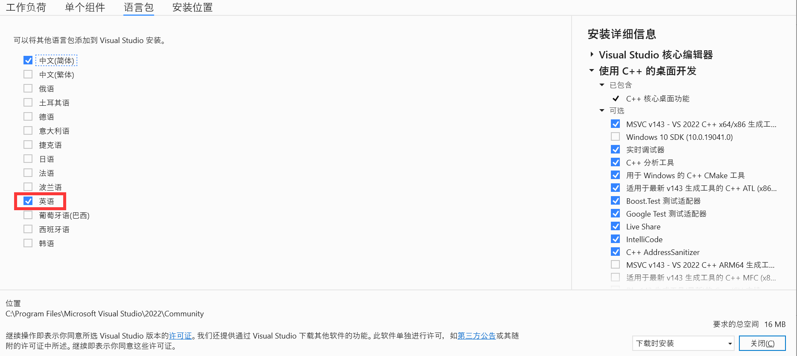

# 串口调试工具

## 一、Windows 下编译安装过程

### 1. 安装 Visual Studio Community 2022

[下载 Visual Studio Community 2022 安装程序](https://visualstudio.microsoft.com/zh-hans/vs/community/)并打开，勾选工作负荷选项卡中的“使用 C++ 的桌面开发”、单个组件选项卡中的“适用于 Windows 的 Git”和语言包选项卡中的“英语”，安装并重启系统。







### 2. 安装 vcpkg 包管理工具

选择一个文件夹作为 vcpkg 包管理工具的安装文件夹，命令行切换到该文件夹下，执行以下命令：

``` powershell
PS C:\> git clone "https://github.com/Microsoft/vcpkg.git"
PS C:\> cd vcpkg
PS C:\vcpkg> .\bootstrap-vcpkg.bat
PS C:\vcpkg> .\vcpkg.exe integrate install
```

### 3. 编译运行

使用文件资源管理器打开项目文件夹，右键项目文件夹空白处，选择 Open with Visual Studio，用 Visual Studio 打开项目。在界面上方选择调试目标为 `quartframeparser.exe` （Release 模式下）或 `quartframeparserd.exe` （Debug 模式下）即可启动项目。（第一次编译启动时间较久）
