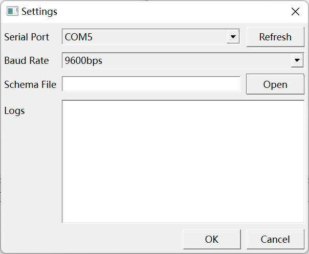
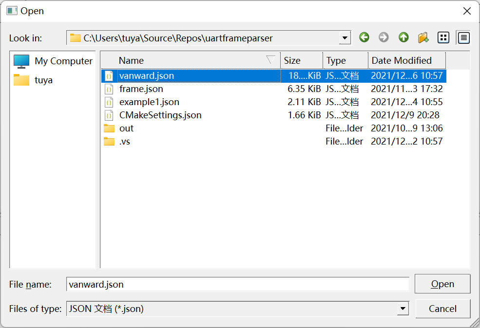
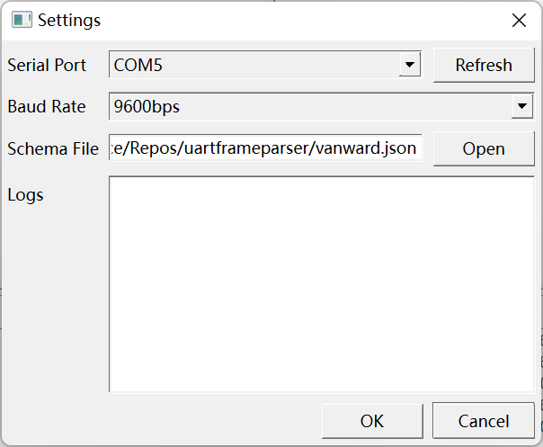
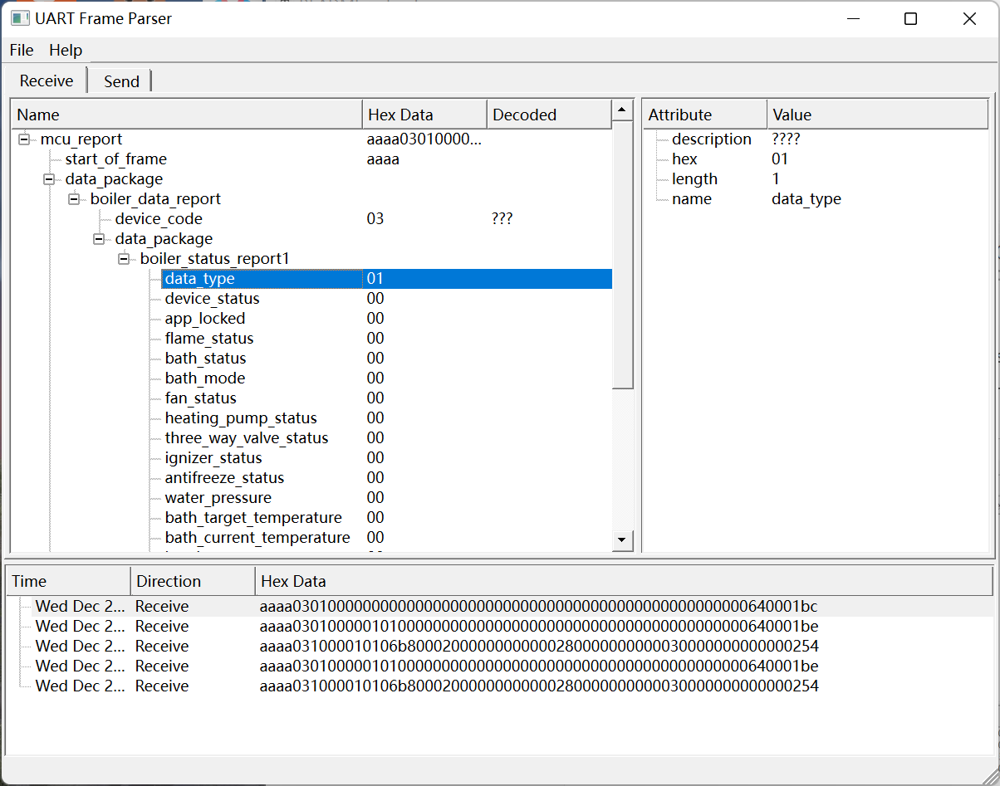
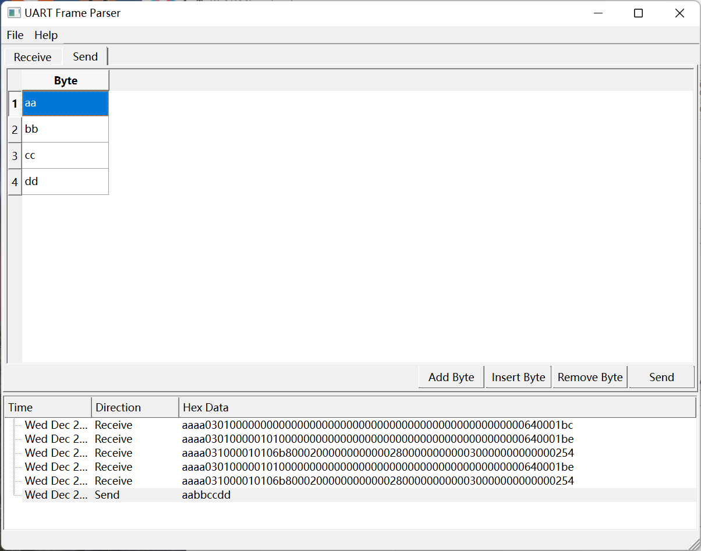

# 串口调试工具

## 一、Windows 下编译安装过程

### 1. 安装 Visual Studio Community 2022

[下载 Visual Studio Community 2022 安装程序](https://visualstudio.microsoft.com/zh-hans/vs/community/)并打开，勾选工作负荷选项卡中的“使用 C++ 的桌面开发”、单个组件选项卡中的“适用于 Windows 的 Git”和语言包选项卡中的“英语”，安装并重启系统。


### 2. 安装 vcpkg 包管理工具并安装依赖

选择一个文件夹作为 vcpkg 包管理工具的安装文件夹，命令行切换到该文件夹下，执行以下命令：

``` powershell
PS C:\Users\tuya> git clone "https://github.com/Microsoft/vcpkg.git"
PS C:\Users\tuya> cd vcpkg
PS C:\Users\tuya\vcpkg> .\bootstrap-vcpkg.bat
PS C:\Users\tuya\vcpkg> .\vcpkg.exe integrate install
PS C:\Users\tuya\vcpkg> .\vcpkg.exe install cjson:x64-windows lua:x64-windows gtest:x64-windows qtbase:x64-windows qttools:x64-windows qtserialport:x64-windows
```

### 3. 修改调试配置文件

打开项目文件夹下 `.vs` 文件夹的 `launch.vs.json` 文件，将文件中的 `C:\\Users\\tuya\\vcpkg` 替换成你的 vcpkg 实际安装目录：

```json
{
  "version": "0.2.1",
  "defaults": {},
  "configurations": [
    {
      "type": "default",
      "project": "CMakeLists.txt",
      "projectTarget": "quartframeparser.exe",
      "name": "quartframeparser.exe",
      "env": {
        "QT_QPA_PLATFORM_PLUGIN_PATH": "C:\\Users\\tuya\\vcpkg\\installed\\x64-windows\\Qt6\\plugins\\platforms"
      }
    },
    {
      "type": "default",
      "project": "CMakeLists.txt",
      "projectTarget": "quartframeparserd.exe",
      "name": "quartframeparserd.exe",
      "env": {
        "QT_QPA_PLATFORM_PLUGIN_PATH": "C:\\Users\\tuya\\vcpkg\\installed\\x64-windows\\debug\\Qt6\\plugins\\platforms"
      }
    }
  ]
}
```

### 4. 编译运行

使用文件资源管理器打开项目文件夹，右键项目文件夹空白处，选择 Open with Visual Studio，用 Visual Studio 打开项目。在界面上方选择调试目标为 `quartframeparser.exe` （Release 模式下）或 `quartframeparserd.exe` （Debug 模式下）即可启动项目。

## 二、图形界面使用说明

打开程序后，菜单栏点击 File，选择 Settings 进入设置界面。在设置界面点击 Refresh 检测串口列表，选择对应串口及波特率：



在文本框中输入帧格式描述文件路径，或者点击 Open 打开文件选择对话框以选择帧格式描述文件，点击 OK 应用设置。





此为接收界面，下发显示接收到的串口帧 ，双击可查看帧结构及帧字段，双击帧字段可查看帧字段的详细信息，如帧字段长度、帧字段描述等：



此为发送界面，点击 Add Byte 按钮可增加字节，选中某一字节后点击 Insert Byte 或 Remove Byte 可在该字节前插入字节或者删除该字节。双击字节可编辑，编辑完成后点击 Send 发送字节，发送记录显示在下方列表中，双击发送记录可重新编辑并发送。



## 三、Bug 列表

- [ ] 界面显示中文会出现问号。该问题推测是由于编码方式导致的，但也有可能是字体问题，目前正在排查中。
